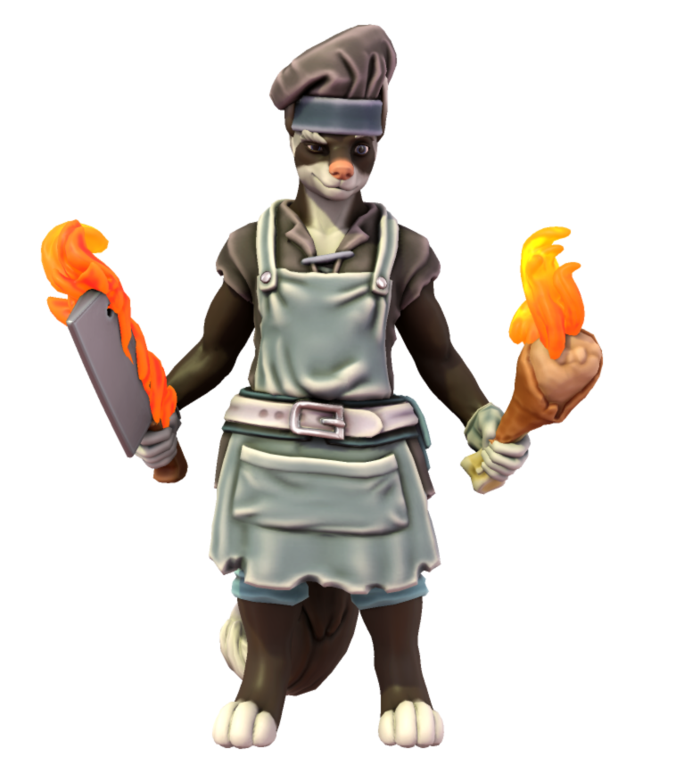

# Foxscular Chef

## Biography

Foxscular makes a mean stew, and he's a good cook. But who is he? And why does he keep showing up everywhere in the world? Whenever we're in need of food, there usually a bar or restaurant where he is ready to serve up the best food in the world. Rumors say 

## Usage

### All Games

Pretty self explanatory. He is the [Officer Jenny](https://pokemon.fandom.com/wiki/Officer_Jenny) of chefs.

## Trivia

- I deleted the original version of Torneth from Hero Forge and had to use Foxscular Chef as the new base when redoing the character because he already closely resembled him. I'll let your imagination run wild with that little fact.
