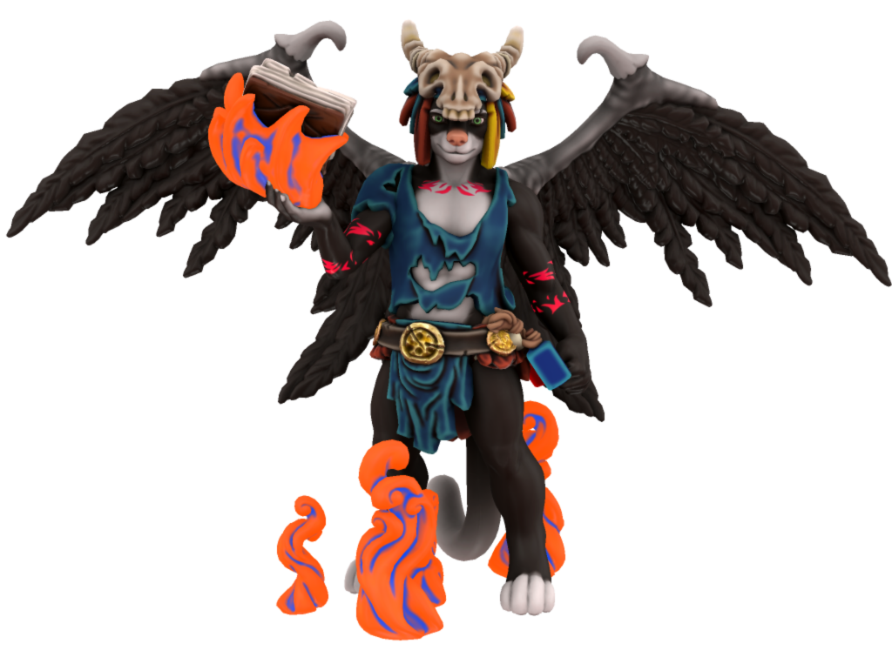

# Torneth

## World Entry

A greedy Tabaxi, Torneth is a former upper-class wizard whom upon discovering the Manual of the Phoenix, unlocked a hidden curse that magically bonded him to the book and turned him into a black furred demon in the process. He now lives an immortal life within the ruins of an old tower.  Despite this, he still free to roam around, but can't go too far. Torneth will never admit the book's curse as it does give him great pain to think about the life he lost centuries ago. Ironically, he has made the Manual of the Phoenix and the ruins it resides his new home and will lie about location of the book when asked. He will secretly attempt to get mana from any mages that tries to get the book in order to gain more power. Despite his greedy behavior, he has mellowed out somewhat, revealing his true personality: he loves to collect fossils, read books, and his upper-class behavior has since resurfaced.

## Usage

### AI Dungeon

Torneth was designed around AI Dungeon's [Wizard scenario](https://ai-dungeon.fandom.com/wiki/Default_Scenario#Fantasy) and is compatible with it. As described in his world entry above, he is intended to be the antagonist and is designed to keep the game truly endless.

In an [early version](https://www.furaffinity.net/view/41439402/) of the character, Torneth was trapped in the The Book of Essence. This was replaced with Manual of the Phoenix due to the [Essence](./../essence.md) functioning as Mana in Legends of Zack and the AI prioritizing vampirism and necromancy because of that definition. This phenomenon was discovered long before Torneth's introduction and was simply an error on my part.

### D&D

I'm not sure how well he would work in D&D campaign due to the fact he was intended to keep the game truly endless.
