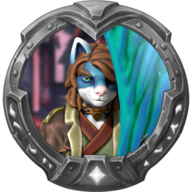

# Introduction

Legends of Zack is a fantasy world based on characters and locations from Casey Universe intended for D&D, AI Dungeon, KoboldAI or alike. At the heart of the world is [Essence](./essence.md), a magical energy that can be used to create powerful spells.

## Origins

The world itself is inspired by and named after an idea created by an old friend from DeviantART, known as T-Up. Known as Legends of Z at the time, Zack received a mallet as a gift from a wizard in order to defeat monsters. In Casey Universe, Zack's mallet has been replaced with a guitar and he is now a bard.