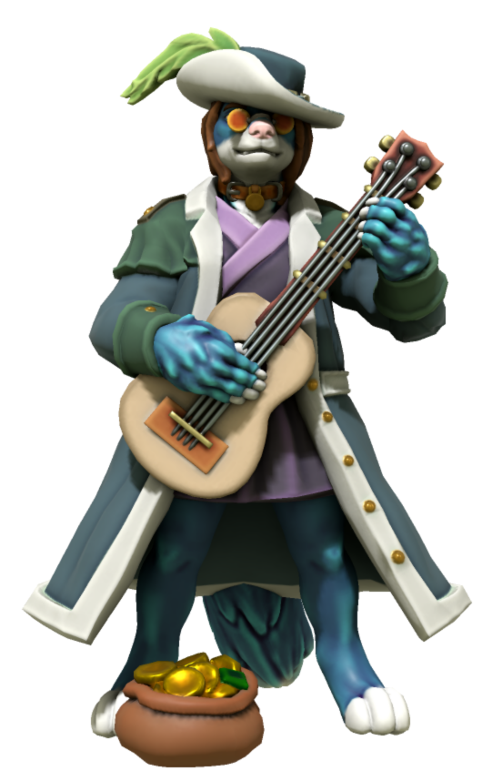

# Origins

Legends of Zack can trace its roots all the way back to 2005. Known as Legends of Z, at the time, Zack (who was simply Z back then) received a mallet as a gift from a wizard in order to defeat monsters. The idea was created by an old DeviantART friend going by T-Up.

The concept was revisited a few times in the over the years but wasn't until a friend showed me AI Dungeon and I got into D&D that the groundwork for Legends of Zack would eventually be made. It began when I wanted to use AI Dungeon's [Wizard scenario](https://ai-dungeon.fandom.com/wiki/Default_Scenario#Fantasy) to create magic system with [Essence](./essence.md) as the source. The way I went about refining that is a story in it of itself.

## The Long Game

<!--  -->

While creating the magic system, I wanted to keep the game endless because I had more fun trying to find the book than actually getting it, which there was always 50/50 chance of. After all, you begin in a ruin that is literally a dungeon. I was able to pull this off in early prototypes of the Essence magic system but it always took me away from the book's location.[^1] Got so crazy I managed to accidentally start a whole war between two Wizards and Rouges that would put Harry Potter to shame.

In order to tame the beast that I've unleashed, I realized I needed to create some balance. This came by adding a rather god-like I met at a hotel who would later become [Artemis](characters/artemis.md). Like getting the book, there is nearly a 50/50 chance you'll run into another wizard searching for the book too. So I decided to base antagonist off of the idea that there was a wizard before you and came up with [Torneth](https://www.furaffinity.net/view/41439402/). Not only did he come long before you but he unlocked a curse that forever has him chained to the book. Meaning, if you want to read it, you'll have to get through him.

## Legends Reborn

On the D&D side of things, I had the idea of turning Zack into a D&D character. He is literally my most developed character in part due to the fact that I'm also a fan of him too. Yes I'm a fan of my character. To keep it fit with D&D's high fantasy setting, I dropped the Furry Blue DJ storyline and turned him bard with an acoustic character. In doing so, I realized I laid the groundwork to actually make Legends of Zack a reality.

It was when I was [redoing Torneth](characters/torneth.md) that I decided to put the Essence, Torneth and Zack all under one roof and make Legends of Zack a reality.

---

[^1]: This was due to the lack of [world info](https://wiki.aidungeon.io/wiki/World_Info) keys that told the AI to stay within the ruin. Don't get me wrong, I still had fun.
